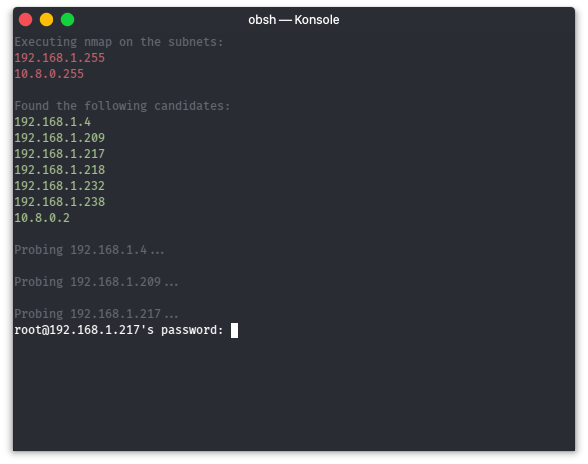

# obsh
A tiny bash script that scans your local networks for SSH servers, and then drops a shell for every server found. Useful for penetration testing and headless setups (Raspberry Pi et al.).  
The name is an acronym that means "obscure shell", which is a weak pun on "secure shell".  
  

